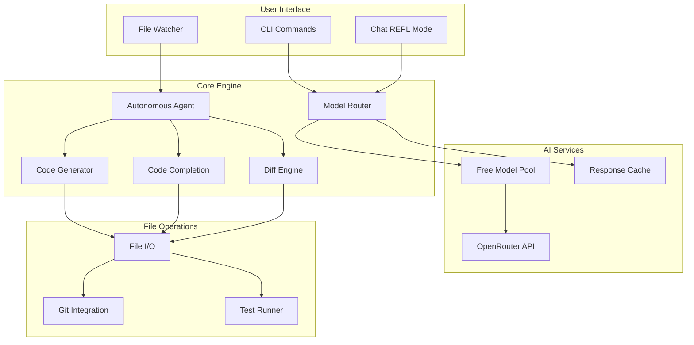

# Vibe CLI Enhancement Plan

## Architecture Overview



## Key Features Implementation

### 1. **Enhanced Model Management**
- Auto-routing based on task type:
  - Code generation → DeepSeek-Coder
  - Chat/explanation → Mistral/GLM
  - Debugging → Qwen-Coder
  - Long context → Gemini-2.0-Flash
- Fallback chain for rate limits
- Cache model responses locally

### 2. **Core Coding Commands**

#### `vibe generate <prompt> [--lang <language>]`
- Generate complete functions/classes
- Auto-detect language from context
- Support 50+ languages
- Stream output with syntax highlighting

#### `vibe complete <file> [--line <n>]`
- Context-aware code completion
- Read surrounding code (±100 lines)
- Support multiple suggestions
- Interactive selection

#### `vibe refactor <pattern> [--type <optimization|clean|security>]`
- Analyze code patterns
- Suggest improvements
- Apply changes with confirmation

### 3. **Multi-File Editing**

#### `vibe edit <glob-pattern>`
- Scan matching files
- Generate unified diffs
- Preview changes in terminal
- Apply with confirmation
- Rollback support

### 4. **Agent Mode**

#### `vibe agent <task> [--auto]`
- Break down complex tasks
- Execute step-by-step
- File operations (read/write/modify)
- Shell command execution
- Git operations
- Permission prompts (unless --auto)

### 5. **Debugging & Analysis**

#### `vibe debug <error-message|file>`
- Parse error messages/stack traces
- Analyze code context
- Suggest fixes with explanations
- Generate test cases

### 6. **Git Integration**

#### `vibe git <review|commit|pr>`
- Auto-generate commit messages
- Create PR descriptions
- Code review with suggestions
- Diff analysis

### 7. **Test Generation**

#### `vibe test <file> [--framework <auto|jest|mocha|vitest>]`
- Auto-detect test framework
- Generate comprehensive test suites
- Mock dependencies
- Coverage analysis

### 8. **Chat REPL Mode**

#### `vibe chat [--model <id>] [--context <dir>]`
- Multi-turn conversations
- Maintain context (up to 128K tokens)
- Code block execution
- File operations from chat
- Export sessions

## Command Structure

### Primary Commands
```
vibe generate   - Generate code from prompts
vibe complete   - Complete code at cursor/line
vibe refactor   - Refactor existing code
vibe edit       - Multi-file editing
vibe agent      - Autonomous task execution
vibe debug      - Debug errors and issues
vibe test       - Generate tests
vibe review     - Code review
vibe chat       - Interactive REPL mode
```

### Utility Commands
```
vibe model      - Model management
vibe config     - Configuration
vibe session    - Session management
vibe git        - Git operations
vibe watch      - File watching
vibe help       - Help system
```

## Implementation Priority

### Phase 1: Core Features (Priority)
1. Code generation (`generate`)
2. Code completion (`complete`)
3. Multi-file editing (`edit`)

### Phase 2: Agent & Automation
4. Agent mode (`agent`)
5. Debugging (`debug`)
6. Test generation (`test`)

### Phase 3: Advanced Features
7. Git integration
8. Code review
9. File watching
10. Enhanced REPL

## Technical Implementation Details

### Model Routing Logic
```javascript
const routeModel = (task) => {
  const taskType = detectTaskType(task);
  const models = {
    'code-generation': ['deepseek/deepseek-coder-v2-lite', 'qwen/qwen2.5-coder-7b'],
    'chat': ['z-ai/glm-4.5-air:free', 'mistral/mistral-nemo-instruct'],
    'debug': ['qwen/qwen3-coder-480b', 'kwaipilot/kat-coder-pro'],
    'long-context': ['google/gemini-2.0-flash-exp:free'],
  };
  return models[taskType] || models['chat'];
};
```

### Error Handling Strategy
- Exponential backoff for rate limits
- Model rotation on 429 errors
- Graceful degradation
- Local caching for responses
- Rollback mechanism for file operations

### Performance Optimizations
- Lazy loading of dependencies
- Streaming responses
- Chunked file processing
- Parallel operations where possible
- Memory-efficient context management

## Success Metrics
- ✅ All existing commands remain functional
- ✅ New commands follow consistent patterns
- ✅ Single-file distribution
- ✅ Zero external dependencies beyond npm
- ✅ Cross-platform compatibility
- ✅ No authentication required
- ✅ Privacy-first (no telemetry)