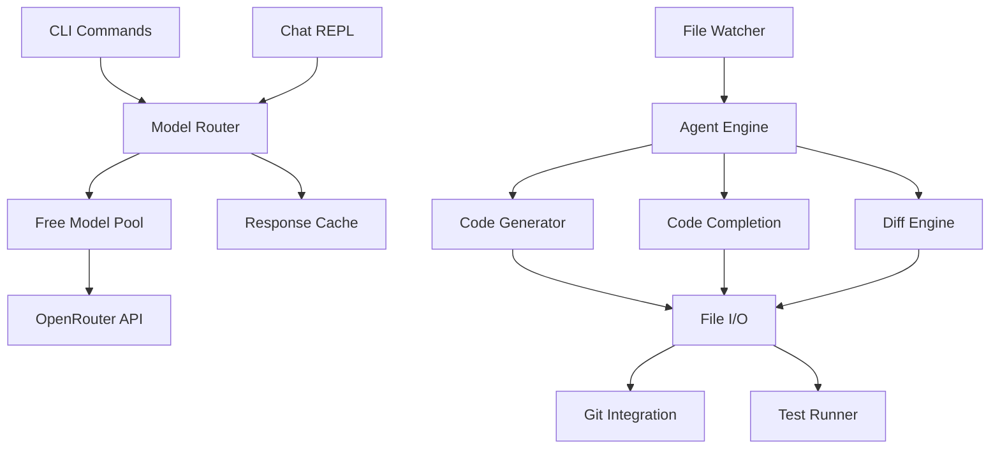

# Vibe CLI (v1.0.6) — Unified Documentation

A free, privacy‑first AI coding assistant focused on terminal‑centric workflows. Vibe routes to community free OpenRouter models using a Bring Your Own Key strategy, emphasizes explicit user control (no silent writes), and provides modular developer tooling (code generation, refactor, debug, test, git assist) plus a lightweight marketing/onboarding web surface.

## 1. High-Level Purpose

- Local-first terminal workflows
- Explicit approval for any file mutations (plan → preview diff → confirm → apply)
- Defensive-only stance (refuses malicious or exploit instructions)
- Free model rotation for resilience against per-model rate limits
- Git-native automation (commit messages, PR descriptions, review context)
- Accessible onboarding & documentation via modular Next.js site

## 2. What’s New in v1.0.6

- Enhanced AI Agent system (better step/context management)
- Specialized developer tools: codegen, debug, refactor, testgen, gittools, multiedit
- Improved OpenRouter integration & model selection
- Enhanced API key management flow
- Automated build & publish pipeline (GitHub Actions)
- Documentation consolidation finalized (removed stale STRUCTURE.md reference in package distribution list)
- License attribution corrected to mk-knight23
- Dependency pruning: removed unused axios, chalk, conf, fs-extra, fuse.js, marked, sharp, xterm, xterm-addon-fit; replaced with native fetch + picocolors
See consolidated changelog summary below.

## 3. Installation

### Quick Install (Recommended)

macOS / Linux:
```bash
# Auto-detect latest version
curl -fsSL https://raw.githubusercontent.com/mk-knight23/vibe-cli/main/install.sh | bash

# Install specific version
VERSION=v1.0.5 curl -fsSL https://raw.githubusercontent.com/mk-knight23/vibe-cli/main/install.sh | bash
```

Windows:
Download latest release asset `vibe-win-x64.exe` and add to PATH as `vibe`.

### Install via npm
```bash
# Global install
npm install -g vibe-cli

# GitHub source
npm i -g github:mk-knight23/vibe-cli#v1.0.5

# One-off run
npx vibe-cli
```

## 4. Quick Start

1. Configure API Key
```bash
vibe config set openrouter.apiKey sk-or-...
export OPENROUTER_API_KEY="sk-or-..."
```

2. Start chatting
```bash
vibe chat "Hello, help me code!"
vibe model use tng/deepseek-r1t2-chimera:free
```

## 5. Core Commands

Basic usage:
```bash
vibe                 # Start interactive chat
vibe chat "message"  # One-off message
vibe help            # List commands
```

AI agent & tooling:
```bash
vibe agent start
vibe codegen
vibe debug
vibe refactor
vibe testgen
vibe gittools
vibe multiedit
```

Model management:
```bash
vibe model list
vibe model use <name>
vibe cost
```

Development:
```bash
vibe plan "feature"
vibe fix
vibe test
vibe run --yolo      # Auto-approval (use carefully)
```

Configuration:
```bash
vibe config set <key> <value>
vibe theme set light
vibe resume
```

## 6. Advanced Feature Domains

- File operations (read/write/edit/move/delete with safeguards)
- Glob pattern context injection
- Batch multi-file diff application
- Web search integration (DuckDuckGo Instant Answer, docs snippets)
- Shell command execution & output injection
- Session management & cost tracking
- Autonomous bounded agent tasks (step-limited, approval-gated)

## 7. Architecture Overview



## 8. Tech Stack

CLI:
- Node.js ≥ 18
- CommonJS modules with potential TypeScript migration plan
- simple-git, native fetch (node-fetch fallback), picocolors (replaces chalk), ora, inquirer

Web:
- Next.js App Router
- React 19
- Tailwind CSS v4 + CSS variables
- Radix UI primitives
- Lucide icons
- Embla carousel

## 9. Unified Project Structure (Post-Cleanup)

```
bin/
  vibe.cjs
cli/
  core/
    apikey.cjs
    openrouter.cjs
    index.cjs
  agent/
    agent.cjs
  code/
    codegen.cjs
    multiedit.cjs
  git/
    gittools.cjs
  refactor/
    refactor.cjs
  debug/
    debug.cjs
  test/
    testgen.cjs
core/
  placeholder-images.json
  placeholder-images.ts
  utils.ts
src/
  app/
    layout.tsx
    page.tsx
  components/
    marketing/
      hero-section.tsx
      features-section.tsx
      capabilities-tabs-section.tsx
      testimonials-section.tsx
      pricing-section.tsx
    quick-start-section.tsx
    code-block.tsx
    ui/...
  hooks/
    use-toast.ts
    use-mobile.tsx
styles/
  globals.css
tailwind.config.cjs
package.json
LICENSE
README.md
```

(Obsolete markdown documents removed; content merged here.)

## 10. Styling & Theming

Active theming uses CSS variables in [`globals.css`](src/app/globals.css:1) and Tailwind custom tokens in [`tailwind.config.cjs`](tailwind.config.cjs:1). Legacy `themes/*.json` removed (unused). Theme toggle planned (Header contains placeholder Moon icon).

## 11. Web Frontend Functional Areas

- Hero section: headline + install snippet
- Quick Start accordion
- Features + capabilities tabs
- Pricing (Free Forever; donation tier placeholder)
- Testimonials carousel
- FAQ
- Planned: MDX docs conversion & dynamic search index
- Placeholder search (Fuse index removed; future dynamic reintroduction)

## 12. Security & Privacy Principles

- BYO key prevents central credential storage
- Defensive-only operation model
- No destructive file operations from web surface
- Avoid exposing environment variables client-side
- Plan for additional headers/middleware hardening

## 13. Deployment Workflow (Standard)

Local:
```bash
npm install
npm run typecheck
npm run build
```
Git:
```bash
git add .
git commit -m "feat: update"
git push origin main
```
Vercel:
- Import repo
- Set OPENROUTER_API_KEY (Production / Preview)
- Deploy → verify sections render & theme toggle
Performance:
- Lighthouse audit
- Trim unused UI primitives / CSS

## 14. Operational Maintenance Guidelines

| Task | Frequency | Notes |
|------|-----------|-------|
| Dependency audit | Monthly | Remove unused Radix modules |
| README update | On release | Reflect versions & changes |
| Model availability check | Weekly | Replace deprecated IDs |
| Token consistency | Quarterly | Sync CSS vars & Tailwind tokens |
| Issues triage | Weekly | Label & prioritize |
| Env keys review | Quarterly | Rotate keys |

## 15. Roadmap Snapshot

- MDX docs & dynamic search indexing
- Feature comparison matrix
- Agent automation hardening
- Blog section (`/blog`) + RSS
- Session playback JSON logs
- Donation/sponsorship tier (non-paywall)
- Theme toggle component
- Search implementation revival under `src/lib/search`

## 16. Glossary

| Term | Meaning |
|------|--------|
| Context Injection | Structured diffs, globs, outputs fed to models |
| Defensive Mode | Refusal logic for harmful instructions |
| Multi-file Diff Planning | Prepare & confirm edits across many files |
| BYO Key | User supplies OpenRouter API key |
| Free Model Rotation | Automatic fallback among zero-cost endpoints |

## 17. Configuration Files

- API keys: `~/.vibe/config.json`
- Sessions: `sessions/`
- Transcripts: `transcripts/`
- Theming: CSS variables + Tailwind tokens (`globals.css`, `tailwind.config.cjs`)

## 18. Environment Variables

- `OPENROUTER_API_KEY` — OpenRouter key
- `VIBE_NO_BANNER=1` — Disable startup banner
- `EDITOR` — Preferred multi-line editor

## 19. File Mutation Safety Model

1. Collect candidate changes
2. Present unified diff preview
3. Require explicit user approval
4. Apply atomically (abort on mismatch)

## 20. Extending the Web Surface

Add new UI primitives under [`src/components/ui`](src/components/ui/button.tsx:1) (avoid bloat). Marketing components under [`src/components/marketing`](src/components/marketing/hero-section.tsx:1). Update placeholder assets in [`core/placeholder-images.json`](core/placeholder-images.json:1). Adjust CSS vars in [`src/app/globals.css`](src/app/globals.css:1).

## 21. Enhancement Plan Highlights

Model routing (conceptual pseudo-code):
```javascript
function routeModel(taskType) {
  const map = {
    'code-generation': ['deepseek/deepseek-coder-v2-lite', 'qwen/qwen2.5-coder-7b'],
    'chat': ['z-ai/glm-4.5-air:free', 'mistral/mistral-nemo-instruct'],
    'debug': ['qwen/qwen3-coder-480b', 'kwaipilot/kat-coder-pro'],
    'long-context': ['google/gemini-2.0-flash-exp:free'],
  };
  return map[taskType] || map['chat'];
}
```

Priority Phases:
1. Core: generate / complete / multiedit
2. Agent + debug + test
3. Git integration + review + watch + enhanced REPL

Performance goals: lazy dependency loading, streaming, chunked processing, rotation on 429, local response caching.

## 22. Changelog (Condensed)

- v1.0.5: Agent improvements, specialized tools, integration upgrades
- v1.0.4: V2 additions (test runner detection, AI commit messages, TUI placeholder), publish workflow
- v1.0.3: Release permission fix (GitHub Actions)
- v1.0.2: Release artifact fixes, smoke test step, initial scaffolding
- v1.0.1: Initial release improvements

(Full historical detail previously in CHANGELOG.md; consolidated here.)

## 23. Troubleshooting

1. Node.js version:
```bash
node --version  # Expect >=18
```
2. Clean reinstall:
```bash
npm uninstall -g vibe-cli
rm -rf $(npm root -g)/vibe-cli
npm i -g vibe-cli
```
3. API key validation:
```bash
echo $OPENROUTER_API_KEY
```
4. Rate limiting: CLI rotates free models automatically.

## 24. Contributing

1. Fork repository
2. Branch: `feat/your-feature`
3. Commit: conventional concise message
4. Push & open PR (include rationale / before vs after)
5. Follow defensive coding guidelines (no unsafe eval, minimal new deps)

## 25. License

MIT License — see [`LICENSE`](LICENSE:1)

## 26. Links

- Repository: https://github.com/mk-knight23/vibe-cli
- Issues: https://github.com/mk-knight23/vibe-cli/issues
- NPM: https://www.npmjs.com/package/vibe-cli
- Author: mk-knight23

## 27. System Requirements

- Node.js ≥ 18.0.0
- npm ≥ 8.0.0
- ~100MB free disk
- Internet for model API calls

## 28. Success Metrics

- Existing commands remain functional
- Safe diff-confirm workflow preserves control
- Free usage maximized with model rotation
- Zero telemetry; privacy-first

## 29. VS Code Extension (Vibe VS Code)

A companion VS Code extension **“Vibe VS Code”** lives in the [`vscode-extension`](vscode-extension/README.md:1) subdirectory. It exposes Vibe’s chat/agent experience directly inside VS Code with multiple modes and personas, powered by OpenRouter.

### 29.1 Install from VSIX (recommended during preview)

1. Download the latest VSIX
   - Go to the repository releases page:
     `https://github.com/mk-knight23/vibe-cli/releases`
   - Download the asset named like:
     `vibe-vscode-0.0.1.vsix` (or newer).
2. Install the VSIX in VS Code
   - Open **Command Palette** → `Extensions: Install from VSIX...`
   - Select the downloaded `vibe-vscode-*.vsix` file.
3. Configure your OpenRouter API key
   - Open **Settings** → search for `vibe`
   - Set `vibe.openrouterApiKey` to your `sk-or-...` key.
   - Optionally adjust:
     - `vibe.defaultModel` (default `z-ai/glm-4.5-air:free`)
     - `vibe.autoApproveUnsafeOps`
     - `vibe.maxContextFiles`
4. Open the Vibe panel in VS Code
   - Command Palette → `Vibe: Open Chat`
   - Or `Vibe: Open Agent Panel` for the agent-focused UI.
   - Use:
     - **⌘ + .** / **Ctrl + .** for next mode
     - **⌘ + ⇧ + .** / **Ctrl + ⇧ + .** for previous mode.

### 29.2 Build the extension from source

If you prefer to build the VSIX yourself:

```bash
cd vscode-extension
npm install
npm run compile
npx @vscode/vsce package
```

This produces `vibe-vscode-*.vsix` in [`vscode-extension`](vscode-extension/README.md:1), which you can install via **“Extensions: Install from VSIX...”** as described above.

### 29.3 Extension source layout

Key extension files:

- Backend entry: [`vscode-extension/src/extension.ts`](vscode-extension/src/extension.ts:1)
- Extension-specific docs: [`vscode-extension/README.md`](vscode-extension/README.md:1)
- Extension manifest: [`vscode-extension/package.json`](vscode-extension/package.json:1)

The extension is designed to be published to the VS Code Marketplace under the `mk-knight23` publisher once it is stable.

---

This single README supersedes prior documentation files (SUMMARY.md, STRUCTURE.md, ENHANCEMENT_PLAN.md, README_WEB.md, CHANGELOG.md). All removed to reduce redundancy and maintenance cost.
